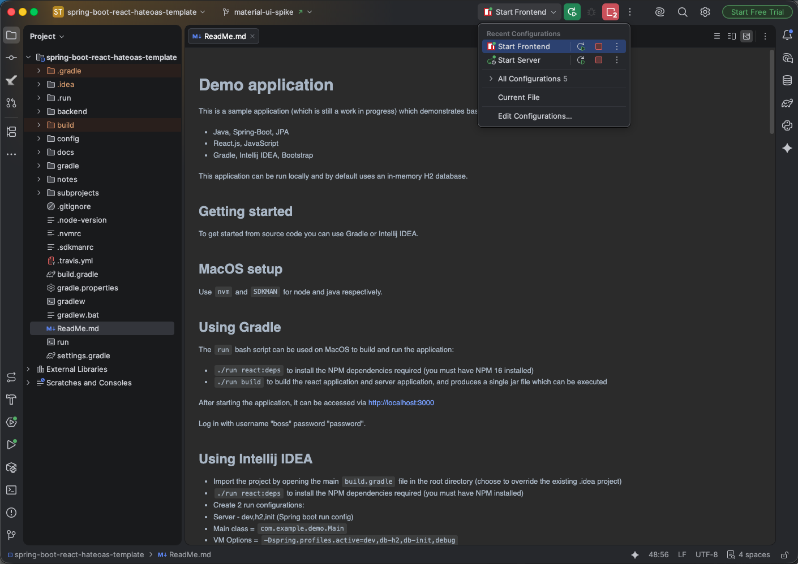
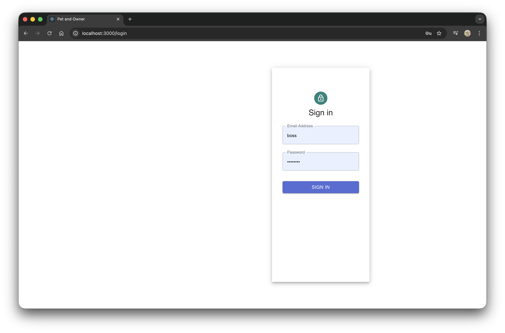
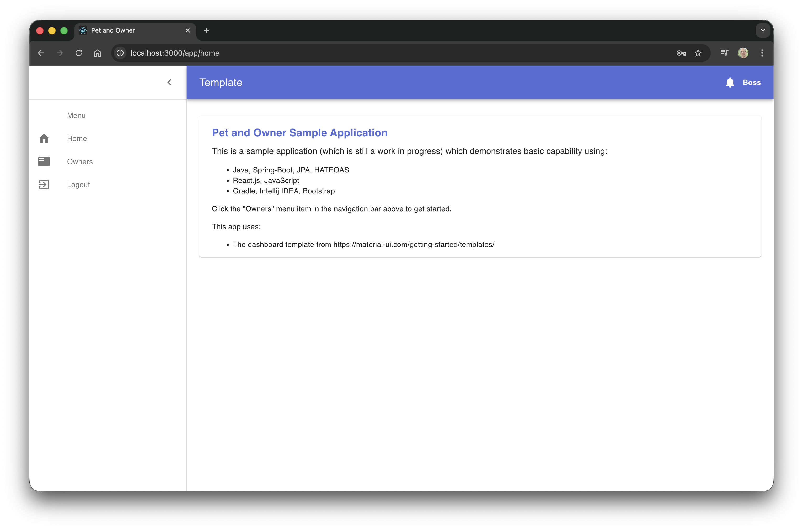
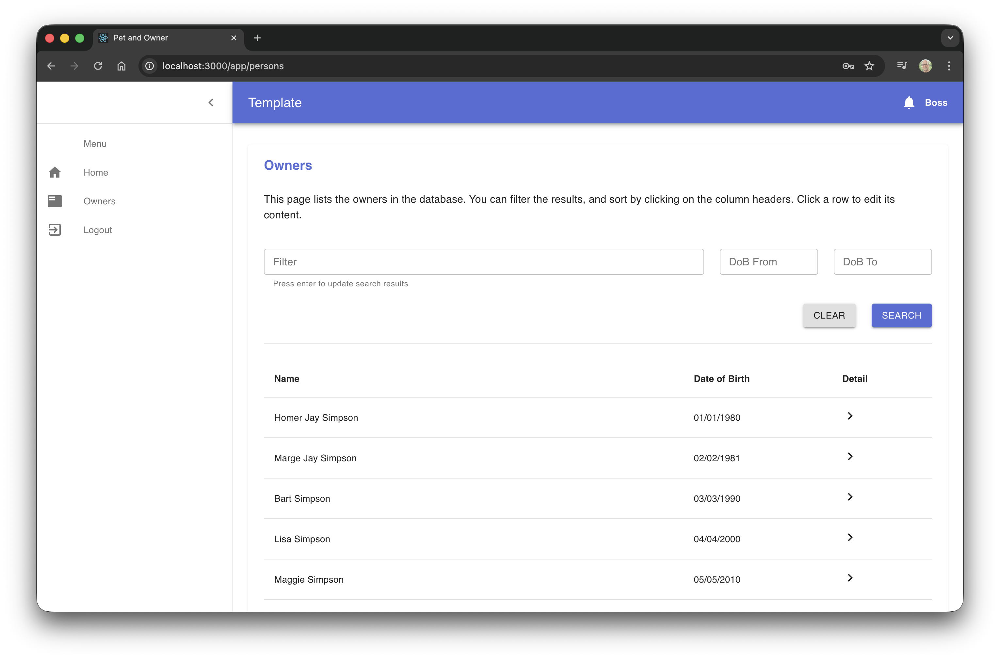
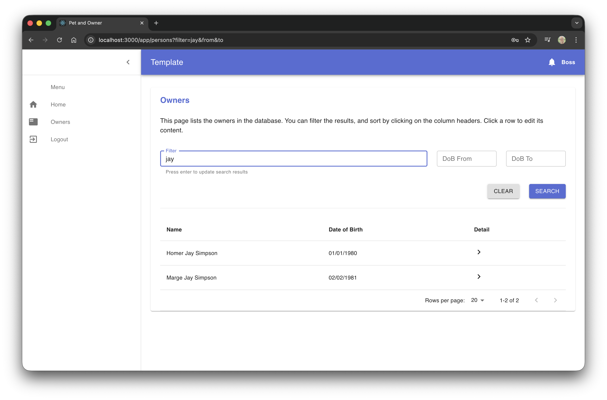
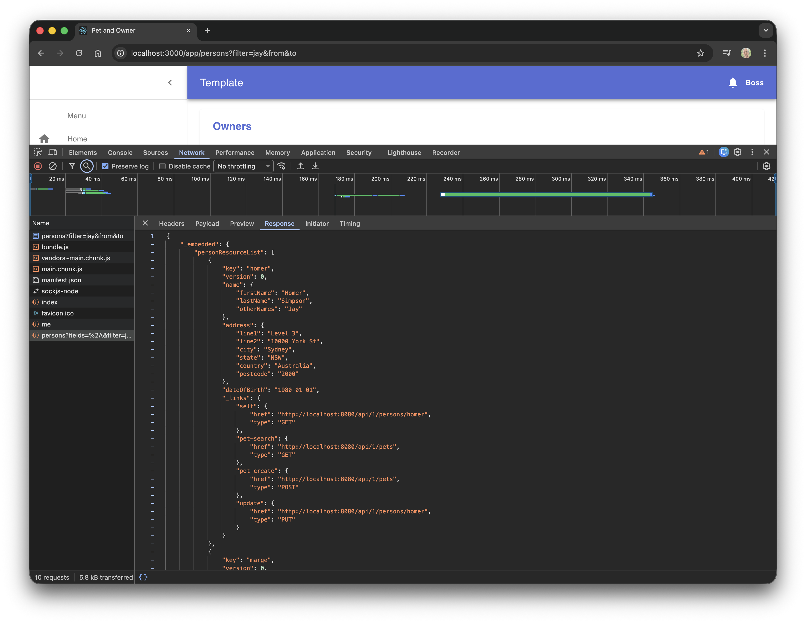

Demo application
================

This is a sample application (which is still a work in progress) which demonstrates basic capability using:

* Java, Spring-Boot, JPA
* React.js, JavaScript
* Gradle, Intellij IDEA, Bootstrap

This application can be run locally and by default uses an in-memory H2 database.

Getting started
----

To get started from source code you can use Gradle or Intellij IDEA.

MacOS setup
-----------

Use `nvm` and `SDKMAN` for node and java respectively.

Using Gradle
----

The `run` bash script can be used on MacOS to build and run the application:

* `./run react:deps` to install the NPM dependencies required (you must have NPM 16 installed)
* `./run build` to build the react application and server application, and produces a single jar file which can be executed

After starting the application, it can be accessed via http://localhost:3000

Log in with username "boss" password "password".

Using Intellij IDEA
----

* Import the project by opening the main `build.gradle` file in the root directory (choose to override the existing .idea project)
* `./run react:deps` to install the NPM dependencies required (you must have NPM installed)
* Create 2 run configurations:
 * Server - dev,h2,init (Spring boot run config)
  * Main class = `com.example.demo.Main`
  * VM Options = `-Dspring.profiles.active=dev,db-h2,db-init,debug`
 * React - start (Bash run config)
  * Script = `./run`
  * Interpreter path = `/bin/bash`
  * Program arguments = `react:start`
* Start the server run config followed by the react run config (server uses port 8080)
* The browser should be opened at http://localhost:3000

Notes
----

* QueryDSL is used to provide type safe criteria, and uses APT processing to generate the `Q` classes - If you are using Intellij IDEA be sure to tick "Enable Annotation Processing" and "Module Content Root".

Road Map
----

There are still a lot of things to add to this to make it a fully rounded sample/template application:

* Refactor to use Domain Driven Design
* Add more custom react components to wrap the material-ui dependencies
* Add Progressive Web App capabilities
* Add more complex JPA validation (custom validation examples)
* Unit tests
* Integration tests
* Selenium/Serenity tests
* React tests
* Improve project documentation and make use of the various Gradle plugins provided by kordamp

Screen shots
=====

